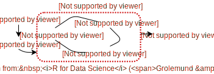

```{r setup, echo = FALSE}
knitr::opts_chunk$set(
  message = FALSE,
  fig.width = 10,
  fig.height = 4,
  comment = "#>",
  collapse = TRUE
)
```

## Expository vis

* plotly.js is awesome for expository/scientific vis!

<p></p>

<div align="center">
  
</div>

---

## Exploratory vis

<p></p>

<div align="center">
  
</div>

* JavaScript lacks tools for iteration (necessary for exploration/discovery!)
  * Data scientists juggle many technolgies (R, Python, JavaScript)

---

## Interactivity augments data exploration!

* Identify structure that otherwise goes missing (Tukey 1972).
* Interactive techniques foster data analysis tasks (Cook et al 1996).
    * Finding Gestalt, posing queries, and making comparisons.
* Generate insights faster (Hofmann & Unwin 1999).
* Better understand/diagnose models (Wickham, Cook, & Hofmann 2015).

<div align="center">
  
</div>

---

## Disconnect between designers and analysts

sdsdfdsf

---
class: center, middle, inverse

# My mission

A single interface that makes 80% of *interactive techniques that support analysis tasks* seamless, quick, and easy (w/o knowledge of web technology).<sup>1</sup>

.footnote[ <sup>1</sup> and the remaining 20% should be possible ]


--- 

## An example 

* albersusa + geom_sf()?

---

## Linking multiple views

<!-- The election example? -->
sadkdsff

---

## Other attempts

* Custom SVG graphics device
  * __gridSVG__ / __SVGAnnotation__ / __ggiraph__
  
* Declarative (JSON) specification
  * ggvis (vega)
  * plotly (plotly.js)
  * rbokeh (bokeh)
  * animint (custom)
  
<!-- 
(1) can guarantee a replicated look, but 
have to build interactivity from the ground-up
-->

---

## R 

* Workflow
  * Exploratory versus expository

## Why linked views?

* Scientific visualization versus data visualization
  * e.g., 3D objects versus a tour
  
