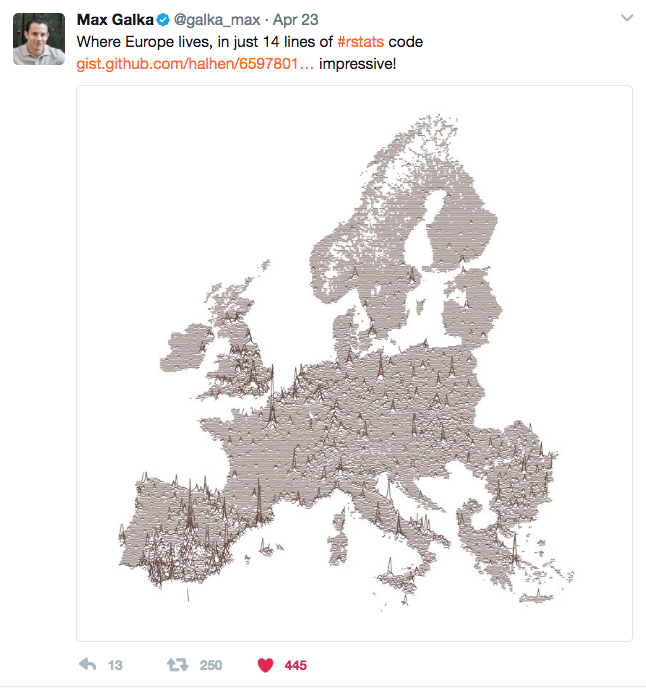
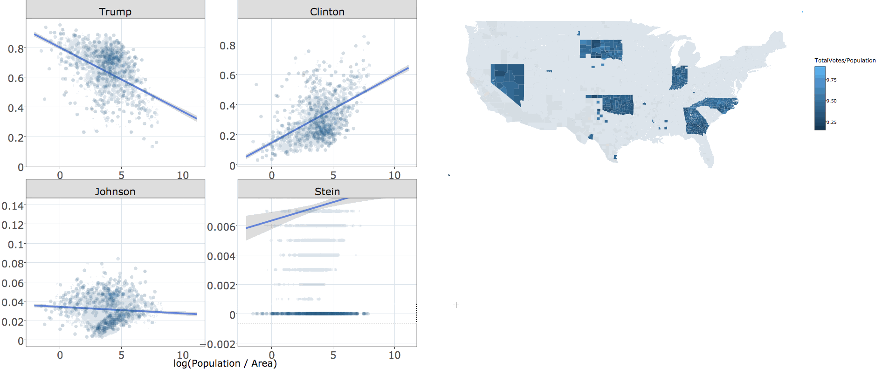

class: inverse, middle

## Data Science Workflow

<div align="center">
  
</div>

???

I love this diagram from the R for Data Science book.

Concisely captures the main components.

---
class: inverse, middle

## Expository vis

<p></p>

<div align="center">
  
</div>

#### plotly.js is awesome for expository/scientific vis!

???

The web has become the preferred medium for communicating results.

Once you know what you want to show, plotly.js is a great choice!!

---
class: inverse, middle

## Exploratory vis

<p></p>

<div align="center">
  
</div>

* Data scientists have to juggle many technolgies (R, Python, JavaScript)

???

JavaScript lacks tools for iteration (necessary for exploration/discovery!)

---
class: inverse, center

## It is all too easy for statistical thinking to be **swamped by programming tasks.**

<div align="center">
  
</div>

Quote from Brian D. Ripley


???

So, this is me, in my 2nd year of grad school, deciding to learn D3 & JavaScript.

It took me 6+ months to implement a single interactive visualization.

And let me tell you, you guys, no joke, believe me, I arose from the swamp, and decide I alone will...


---
class: inverse, center, middle

# `r emo::ji("point_up")` `r emo::ji("tangerine")` 

<div align="center">
  
</div>


---
class: middle
background-image: url(plotly.svg)
background-size: 100px
background-position: 90% 8%

# My mission

A single (R) interface that:

1. Doesn't require knowledge of web technologies.
2. Works seamlessly with other "tidy" tools in R.
3. Easy<sup>1</sup> to declare interactive *techniques that support common data analysis tasks*<sup>2</sup>.

.footnote[ 
[1]: 80% should be easy (i.e., don't require extra knowledge), but the remaining 20% should be possible. <br />
[2]: Analysts usually have different needs from the terminal audience.
]
  
---
background-image: url(plotly.svg)
background-size: 100px
background-position: 90% 8%
## Interactivity augments data exploration!

* Identify structure that otherwise goes missing ([Tukey 1972]()).
* Interactive techniques foster data analysis tasks ([Cook et al 1996]()).
    * Finding Gestalt, posing queries, and making comparisons.
* Better understand/diagnose models ([Wickham, Cook, & Hofmann 2015]()).

???

* Let's not forget -- statisticians have been thinking about the problem for 50 years!
* Easy to get lost in a sea of techniques -- easier if you motivate via data analysis tasks.
* Not everyone has a need to diagnose models, but everyone has a need to get stuff done

---
background-image: url(plotly.svg)
background-size: 100px
background-position: 90% 8%
## Interactivity augments data exploration!

* Identify structure that otherwise goes missing ([Tukey 1972]()).
* Interactive techniques foster data analysis tasks ([Cook et al 1996]()).
    * Finding Gestalt, posing queries, and making comparisons.
* Better understand/diagnose models ([Wickham, Cook, & Hofmann 2015]()).
* Generate insights faster ([Hofmann & Unwin 1999]()).

<div align="center">
  
</div>

???

This is especially true as data becomes more accessible...less formal mathematical models testing exact questions, more flexible tools for posing graphical queries about data

---
background-image: url(workflow2.svg)
background-size: 250px
background-position: 90% 8%
class: inverse, center, middle

### No matter how complex and polished the individual operations are, it is often 

# the quality of the glue that most directly determines the power of the system.

.footnote[
Quote from [Hal Abelson]() -- part of the [tidyverse manifesto](https://cran.r-project.org/package=tidyverse)
]

???

Generating faster insights requires good glue. This comes in two parts:
  * Works seamlessly with other programming interfaces (iteration time!)
  * Works seamlessly with other graphical interfaces (i.e., can link components from independent systems).

---
class: center, middle

<!-- Find the data is beatiful post! -->

<a href="https://twitter.com/galka_max/status/856167515701084166" target="_blank" >
  
</a>

---

```r
library(tidyverse)
library(plotly)

d <- read_csv('GEOSTAT_grid_POP_1K_2011_V2_0_1.csv') %>%
  rbind(read_csv('JRC-GHSL_AIT-grid-POP_1K_2011.csv') %>%
          mutate(TOT_P_CON_DT = '')) %>%
  mutate(
    lat = as.numeric(gsub('.*N([0-9]+)[EW].*', '\\1', GRD_ID))/100,
    lng = as.numeric(gsub('.*[EW]([0-9]+)', '\\1', GRD_ID)) * ifelse(gsub('.*([EW]).*', '\\1', GRD_ID) == 'W', -1, 1) / 100
  ) %>%
  filter(lng > 25, lng < 60) %>%
  group_by(lat = round(lat, 1), lng = round(lng, 1)) %>%
  summarize(value = sum(TOT_P, na.rm = T))  %>%
  ungroup() %>%
  tidyr::complete(lat, lng)

*# make each latitude "highlight-able"
*sd <- crosstalk::SharedData$new(d, ~lat)

p <- ggplot(sd, aes(lng, lat + 5*(value / max(value, na.rm = T)))) +
  geom_line(
    aes(group = lat, text = paste("Population:", value)),
    size = 0.4, alpha = 0.8, color = '#5A3E37', na.rm = T
  ) +
  coord_equal(0.9) + 
  ggthemes::theme_map()

*ggplotly(p) %>% highlight(persistent = TRUE)
```

---

<iframe src="../workshop/day1/europe.html" width="100%" height="750" scrolling="no" seamless="seamless" frameBorder="0"> </iframe>


---
background-image: url(plotly.svg)
background-size: 100px
background-position: 90% 8%

## Linking multiple views

<a href="election.mp4" >
  <div align="center" >
    
  </div> 
</a>

---
background-image: url(plotly.svg)
background-size: 100px
background-position: 90% 8%

## Customize/transform the selection

```r
highlight(
  gg, persistent = TRUE, dynamic = TRUE, selectize = TRUE,
  selected = attrs_selected(mode = "markers+lines", marker = list(symbol="x"))
)
```

<iframe src="custom.html" width="100%" height="390" scrolling="no" seamless="seamless" frameBorder="0"> </iframe>

---
background-image: url(plotly.svg)
background-size: 100px
background-position: 90% 8%

## Linking animated views

<a href="../workshop/day2/15.html" >
  <div align="center" >
    
  </div> 
</a>

---
background-image: url(plotly.svg)
background-size: 100px
background-position: 90% 8%

## Link with other widgets

<iframe src="leaflet2/index.html" width="100%" height="600" scrolling="no" seamless="seamless" frameBorder="0"> </iframe>


---

```r
library(leaflet)
library(crosstalk)
library(plotly)

sd <- SharedData$new(quakes)
stations <- filter_slider("station", "Number of Stations", sd, ~stations)

p <- plot_ly(sd, x = ~depth, y = ~mag) %>% 
  add_markers(alpha = 0.5) %>% 
  highlight("plotly_selected", dynamic = TRUE)

map <- leaflet(sd) %>% 
  addTiles() %>% 
  addCircles()

bscols(p, map, stations)
```


---

```r
library(leaflet)
library(crosstalk)
library(plotly)

*# Input data for every view!
*sd <- SharedData$new(quakes)
stations <- filter_slider("station", "Number of Stations", sd, ~stations)

p <- plot_ly(sd, x = ~depth, y = ~mag) %>% 
  add_markers(alpha = 0.5) %>% 
  highlight("plotly_selected", dynamic = TRUE)

map <- leaflet(sd) %>% 
  addTiles() %>% 
  addCircles()

bscols(p, map, stations)
```


### TAKE HOME MESSAGE: Build upon uniform data structures!

---
class: inverse, middle, center
background-image: url(headshots.png)
background-size: contain

## Standing on the shoulders of giants


---
background-image: url(plotly.svg)
background-size: contain

## Thank you! Questions?

.footnote[
More resources:

https://bit.ly/plotcon17workshop <br />
https://cpsievert.github.io/plotly_book
]

---
class: bottom
background-image: url(plotly.svg)
background-size: contain

.footnote[
Slides released under <a href='https://github.com/cpsievert/talks/blob/gh-pages/LICENSE'>Creative Commons</a>
]
