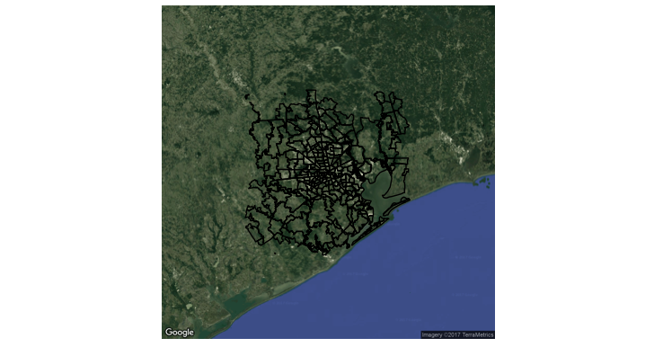
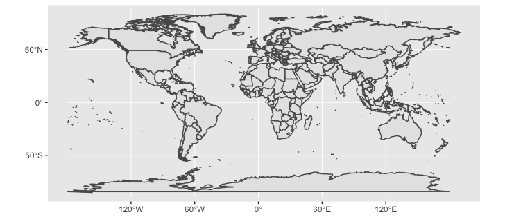
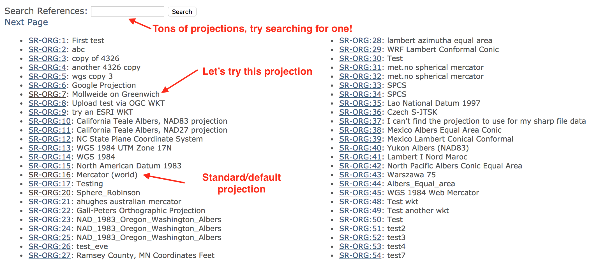
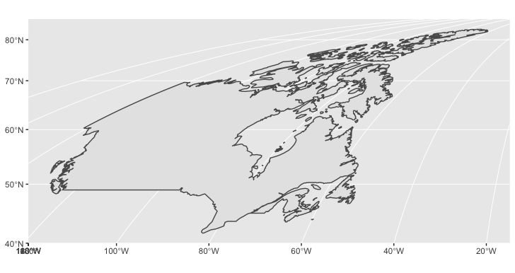

class: inverse, center
background-image: url(../your-turn.jpeg)
background-size: contain

## Your Turn

(1) Do you have the required software (i.e., could you run `devtools::install_github('cpsievert/plotcon17')` without error)?

(2) Share (with your neighbor) 3 things you're hoping to get from this workshop (share them with me, via [Slack](https://plotconrworkshop.slack.com) if you like!)

.footnote[
PS. remember this background image -- it means I want something from you!
]

---

### About me

* PhD in statistics from Iowa State (defended 4 months ago!)
* Maintainer of plotly's R package (for nearly 2 years!)
    * Before that: animint, LDAvis, pitchRx, rdom

### About the workshop

* Focus on things that are hard to learn from documentation alone.
* Today is mainly about core ideas (& lots of mapping examples).
* Tomorrow is a bit more advanced: animation, linked views, & shiny.
* I'm hoping to save time today/tomorrow for a Q&A session.
  * Feel free to stop me at any time.
  * Feel free to ask me about personal projects during down time.
  
.footnote[
Did anyone attend my talk on Tuesday?
]
  
---
## About the attendees

<iframe src="attendees.html" width="100%" height="450" scrolling="no" seamless="seamless" frameBorder="0"> </iframe>

<https://plot.ly/ggplot2/geom_density/>

---
## About the attendees, another look

<iframe src="attendees2.html" width="100%" height="450" scrolling="no" seamless="seamless" frameBorder="0"> </iframe>

<https://plot.ly/r/parallel-coordinates-plot/>

---

## R wisdom

> Everything that **exists** is an **object**.
> 
> Everything that _happens_ is a _function call_. 
>
> -- John Chambers

---

## R wisdom

> Everything that **exists** is an **object**.
> 
> Everything that _happens_ is a _function call_. 
>
> -- John Chambers

<div align="center" >
  
</div>

```{r, include = FALSE}
knitr::opts_chunk$set(
  eval = FALSE,
  message = FALSE,
  fig.width = 10,
  fig.height = 4,
  comment = "#>",
  collapse = TRUE
)
```

---
## Universal truths

Use the `str()` function to inspect any object (`View()` in RStudio is a nice interactive alternative).

```{r, eval = TRUE}
str(mtcars)
```

Use `<-` to assign value(s) to a name

```{r, eval = TRUE}
nms <- names(mtcars)
nms
```

---
## The pipe operator (`%>%`)

Takes object on LHS and inserts into function on RHS. 

```{r, eval = TRUE}
library(magrittr)
mtcars %>% names()
```

Makes function composition more readable

```{r, eval = TRUE}
# read left-to-right
mtcars %>% names() %>% length()


# not inside out
length(names(mtcars))
```

---
## R's basic data structures

<div align="center" >
  
</div>

.footnote[
Read Hadley Wickham's brilliant chapter on data structures http://adv-r.had.co.nz/Data-structures.html
]


---
## A data frame holds (homo or hetero!) 1d vectors.

<div align="center" >
  
</div>

.footnote[
Read Hadley Wickham's brilliant chapter on data structures http://adv-r.had.co.nz/Data-structures.html
]

---
## More than a table

<div align="center" >
  
</div>

.footnote[
Watch Jenny Bryan's brilliant talk https://www.youtube.com/watch?v=4MfUCX_KpdE
]

---
class: inverse, middle, center
background-image: url(https://media.giphy.com/media/h4Z6RfuQycdiM/giphy.gif)
background-size: contain


# How is this useful?

---

# What data goes into drawing this map?

<iframe src="map.html" width="100%" height="550" scrolling="no" seamless="seamless" frameBorder="0"> </iframe>

---

```{r}
library(albersusa)
usa <- usa_sf("laea")

library(dplyr)
usa %>%
 select(name, pop_2010, geometry) %>%
 View()
```

<div align="center">
  
</div>

```{r, echo = FALSE, eval = TRUE}
library(albersusa)
library(dplyr)
```

```{r, eval = TRUE}
usa_sf("laea") %>% select(pop_2010, geometry) %>% plot()
```

---
class: inverse, middle, center

# Rows should represent the unit of interest!!! 

Hadley Wickham (probably)

---

## An aside on dplyr

The R package **dplyr** makes common SQL-like operations fast and easy<sup>1</sup>

Important single table operations:

* `select()`
* `mutate()`
* `filter()`
* `arrange()`
* `distinct()`
* `summarise()`

I will use dplyr sporadically through the workshop...please stop me if anything needs more explaining

.footnote[
[1]: It will even perform SQL queries for you -- using the same interface!
]

---
class: inverse, center
background-image: url(../your-turn.jpeg)
background-size: contain

## Your turn

See `help(geom_sf, package = "ggplot2")`. Can you plot population by state using `geom_sf()` and `usa_sf("laea")`?

**Bonus:** Use `plotly::ggplotly()` to convert it to an interactive version!

.footnote[
Solution is [here](01-your-turn.R)

PS. Someone commented "I would really like to learn more about working with shapefiles". Hopefully `sf::st_read()` *just works* for you!
]

---

```{r}
library(plotly)
usa_sf <- mutate(
  usa_sf("laea"), txt = paste("The state of", name, "had \n", pop_2010, "people in 2010")
)
p <- ggplot(usa_sf) + 
  geom_sf(aes(fill = pop_2010, text = txt)) 
ggplotly(p, tooltip = "text")
```

<iframe src="map2.html" width="100%" height="550" scrolling="no" seamless="seamless" frameBorder="0"> </iframe>

---
class: inverse, center, middle

# More compelling examples

Tooltips & zooming are cool -- but we can do more!

---
class: center, middle

<a href="https://twitter.com/galka_max/status/856167515701084166" target="_blank" >
  
</a>

---
## [Add 2 lines](https://gist.github.com/cpsievert/7dd28a478b4c051180d802321353259d), & voila!

<iframe src="europe.html" width="100%" height="600" scrolling="no" seamless="seamless" frameBorder="0"> </iframe>

---
class: center, middle

<a href="https://twitter.com/jalapic/status/732360615730266112" target="_blank" >
  
</a>

---

See `demo("highlight-epl", package = "plotly")`

<a href="epl.html">
  <div align="center">
    
  </div>
</a>

---
class: inverse, center, middle

# Disclaimer

I'd say ~80% of the ggplot2 API is correctly translated by `ggplotly()`.

I'm aiming for ~99% before the end of the year.

Regardless, knowing how it all works helps to workaround limitations & specify additional features not supported by the ggplot2 API

---
class: inverse, center
background-image: url(magic.gif)
background-size: contain

# How does it work?

---

## ggplotly returns a plotly htmlwidget

```{r}
class(p)
#> [1] "gg"     "ggplot"
gg <- ggplotly(p, tooltip = "text")
class(gg)
#> [1] "plotly"     "htmlwidget"
```

The [htmlwidgets](http://www.htmlwidgets.org/) framework guarantees things *just work* in any context.<sup>1</sup>

The htmlwidgets gallery has 85 registered widgets to date! http://gallery.htmlwidgets.org/

.footnote[
[1]: For example, at your R prompt, inside RStudio, rmarkdown, or shiny apps
]

---
class: inverse, center
background-image: url(../your-turn.jpeg)
background-size: contain

## Your Turn

Embed the `gg` map in an rmarkdown document.

**Bonus**: get the plot to print in an [r notebook](http://rmarkdown.rstudio.com/r_notebooks.html)


---

## What happens when you print a plotly htmlwidget?

<div align="center" >
  
</div>


.footnote[
All htmlwidgets take this same (R list -> JSON -> JavaScript -> HTML) approach!

Every htmlwidget is defined through an R list. Any R list maps to JSON through **jsonlite** package
]

---

## Mapping R list to JSON

```{r, eval = TRUE}
barchart <- list(
  data = list(list(
    x = c("a", "b", "c"),
    y = c(1, 2, 3),
    type = "bar"
  ))
)
plotly:::to_JSON(barchart, pretty = TRUE)
```

.footnote[
**Pro tip:** Did you know `:::` can access *any* object from *any* package (exported or not)?
]

---
## Indexing/subsetting in R

Grab a list element with `$` or `[[`

```{r, eval = TRUE}
str(barchart$data)
identical(barchart$data, barchart[["data"]])
```

There is also `[`, which _always_ returns the "container"!

```{r, eval = TRUE}
str(barchart["data"])
```

---

```{r, eval = TRUE}
str(mtcars["vs"])
str(mtcars[["vs"]])
```

<div align="center" >
  
</div>


---
## Mapping R list to plotly

```{r, eval = TRUE}
library(plotly)
as_widget(barchart)
```

---
## PSA: use `plot_ly()` over `as_widget()`

```{r, eval = TRUE}
# plot_ly() adds some useful abstractions that we'll get to later
plot_ly() %>%
  add_bars(
    x =  c("a", "b", "c"),
    y = c(1, 2, 3), 
    unsupported = "nonsense"
  )
```

---
class: inverse, middle, center

# Three ways to widget<sup>1</sup>

`ggplotly()`: translates ggplot to widget

`as_widget()`: translates R lists to widget

`plot_ly()`: translate a custom R-specific grammar to widget

.footnote[
[1]: Actually, four, if you count `api_download_file()`
]

---
## Inspect the JSON behind any widget

```{r}
# In recent versions of RStudio -- gg %>% plotly_build() %>% View()
plotly_json(gg)
```

<iframe src="spec.html" width="90%" height="325" seamless="seamless" frameBorder="0"> </iframe>


The `data`, `layout`, and `config` attributes are official plotly.js attributes covered in the [figure reference](https://plot.ly/r/reference/).

The other attributes are unique to the R package (don't worry about them).


---
## Modify any widget

`style()` modifies data attributes. `layout()` modifies the layout.

```{r}
gg2 <- gg %>%
  style(mode = "markers+lines", traces = 2) %>%
  layout(title = "A map of 2010 population", margin = list(t = 30))
```

<iframe src="map3.html" width="100%" height="550" scrolling="no" seamless="seamless" frameBorder="0"> </iframe>

---
# Note the modification!

```{r}
# The 'x' element stores the list converted to JSON
# plotly_json() just provides a more pleasant interface to gg$x
str(gg2$x$data[[2]])
```

```r
#> List of 14
#>  $ x         : num [1:238] -324546 -325004 -325571 -325589 -326462 ...
#>  $ y         : num [1:238] -110164 -119390 -130838 -131207 -149343 ...
#>  $ text      : chr "The state of Wyoming had <br /> 564358 people in 2010"
#>  $ type      : chr "scatter"
*#>  $ mode      : chr "markers+lines"
#>  $ line      :List of 3
#>   ..$ width: num 1.89
#>   ..$ color: chr "rgba(89,89,89,1)"
#>   ..$ dash : chr "solid"
#>  $ fill      : chr "toself"
#>  $ fillcolor : chr "rgba(19,43,67,1)"
#>  $ hoveron   : chr "fills"
#>  $ showlegend: logi FALSE
#>  $ xaxis     : chr "x"
#>  $ yaxis     : chr "y"
#>  $ hoverinfo : chr "text"
#>  $ frame     : chr NA
```

---
## Can also add data to any widget

There are a number of `add_*()` functions (e.g., `add_bars()`, `add_polygons()`, `add_trace()`).

```{r}
d <- gg$x$data[[52]]
add_polygons(gg, x = d$x, y = d$y, color = I("red"), inherit = FALSE)
```

<iframe src="map4.html" width="100%" height="550" scrolling="no" seamless="seamless" frameBorder="0"> </iframe>

---
## Resources for studying the figure reference

https://plot.ly/r/reference/

https://github.com/rreusser/plotly-doc-viewer

```{r}
# In recent versions of RStudio -- View(plotly:::Schema)
schema()
```

<iframe src="schema.html" width="100%" height="400" seamless="seamless" frameBorder="0"> </iframe>

---
class: inverse, center
background-image: url(../your-turn.jpeg)
background-size: contain

## Your Turn

Overlay text on top of Wyoming using either a [scatter trace with text mode](https://plot.ly/r/reference/#scatter-mode) or an [annotation](https://plot.ly/r/reference/#layout-annotations)

**Tip**: Use `sf::st_centroid()` to find the center point of polygon(s).

**Bonus**: Can you label all the states?


.footnote[
Solution is [here](02-your-turn.R)
]

---
## Raster objects

* Raster objects are basically a matrix of color codes. These objects can be used to represent bitmap images. 

```{r, eval = TRUE}
m <- matrix(hcl(0, 80, seq(50, 80, 10)), nrow = 4, ncol = 5)
(r <- as.raster(m))
plot(r)
```

---
## Embedding raster objects in plotly

```r
  plot_ly() %>%
  layout(images = list(
*   source = raster2uri(r), # converts a raster object to a data URI.
    xref = "x", yref = "y", x = 0, y = 0, sizex = 1, sizey = 1,
    sizing = "stretch", xanchor = "left", yanchor = "bottom"
  ))
```

```{r, echo = FALSE}
plot_ly() %>%
  layout(images = list(
    source = raster2uri(r),
    xref = "x", 
    yref = "y", 
    x = 0, y = 0, 
    sizex = 1, sizey = 1, sizing = "stretch",
    xanchor = "left", yanchor = "bottom"
  ))
```

<iframe src="raster.html" width="100%" height="400" seamless="seamless" frameBorder="0"> </iframe>

---
## ggmap objects are bitmap images!

```{r}
library(ggmap)
basemap <- get_map(maptype = "satellite", zoom = 8)
p <- ggmap(basemap) +
  geom_polygon(aes(x = lon, y = lat, group = plotOrder),
    data = zips, colour = "black", fill = NA) +
  ggthemes::theme_map()
```

<div align="center">
  
</div>

---
## Add zoom/pan/tooltips via `ggplotly()`

```{r}
ggplotly(p)
```

<iframe src="ggmap.html" width="100%" height="500" seamless="seamless" frameBorder="0"> </iframe>

---
## A crossroads in ggplot2 mapping 

* Going forward, `geom_sf()` will be the preferred way to map in **ggplot2**, but it is still under development.
* It will support _any map projection_, thanks to the magic of **sf**.

```{r}
library(maps)
library(sf)
world1 <- st_as_sf(map('world', plot = FALSE, fill = TRUE))
ggplot() + geom_sf(data = world1)
```

<div align="center">
  
</div>


---
## Finding map projections

* <http://www.spatialreference.org/ref/> is invaluable for finding map projections.

<div align="center">
  
</div>

---
## Mollweide projection of Canada

```{r}
# http://spatialreference.org/ref/sr-org/7/proj4/
canada <- subset(world1, ID == "Canada")
canada2 <- st_transform(canada,"+proj=moll +lon_0=0 +x_0=0 +y_0=0 +ellps=WGS84 +units=m +no_defs")
ggplot() + geom_sf(data = canada2)
```

<div align="center">
  
</div>

---
## Now with `ggplotly()`

```{r}
ggplotly()
```

<iframe src="canada.html" width="100%" height="500" seamless="seamless" frameBorder="0"> </iframe>

---
class: inverse, center
background-image: url(../your-turn.jpeg)
background-size: contain

## Your turn

(1) Peruse some of the examples on <https://plot.ly/r/maps/>. Which approach do you like best (`ggplotly()`, `plot_geo()`, or `plot_mapbox()`)? Let me know via Slack. Can you point out some advantages/disadvantages to each approach?

(2) See the last example on <https://plot.ly/r/lines-on-maps/> -- how does the plot know to render in 3D? Can you make a 2D version?

.footnote[
Not interested in maps? Peak through [tomorrow's slides](../day2/index.html). Tell me if you want to see something else!

Have a personal project (related to plotly) that you need help with? Ask me!
]